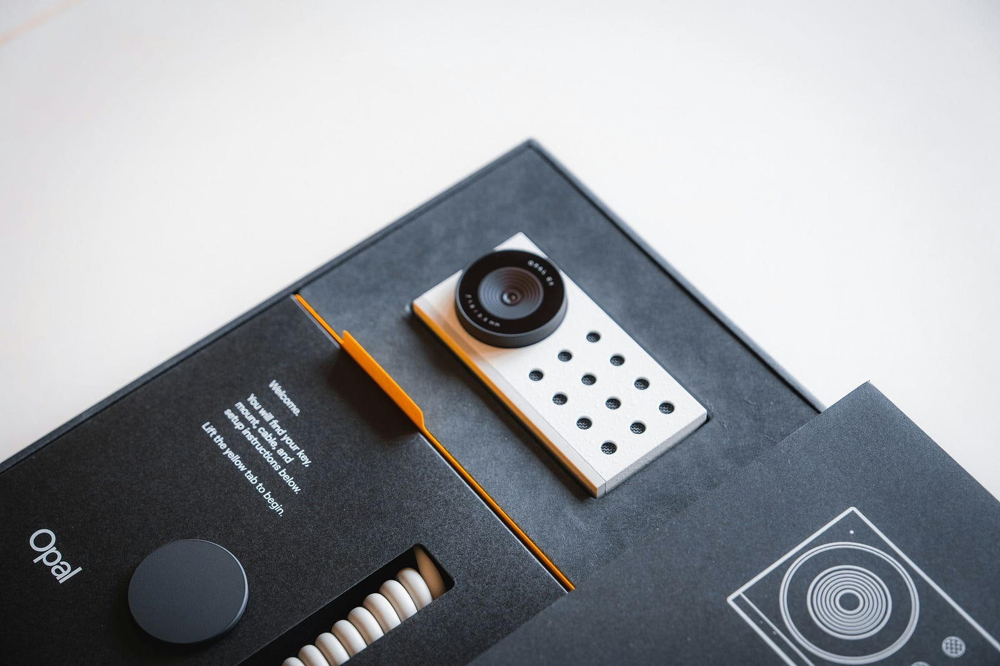
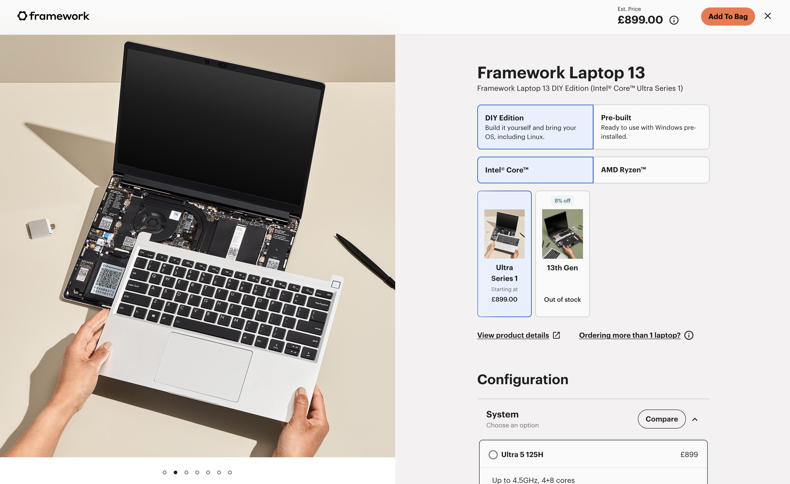
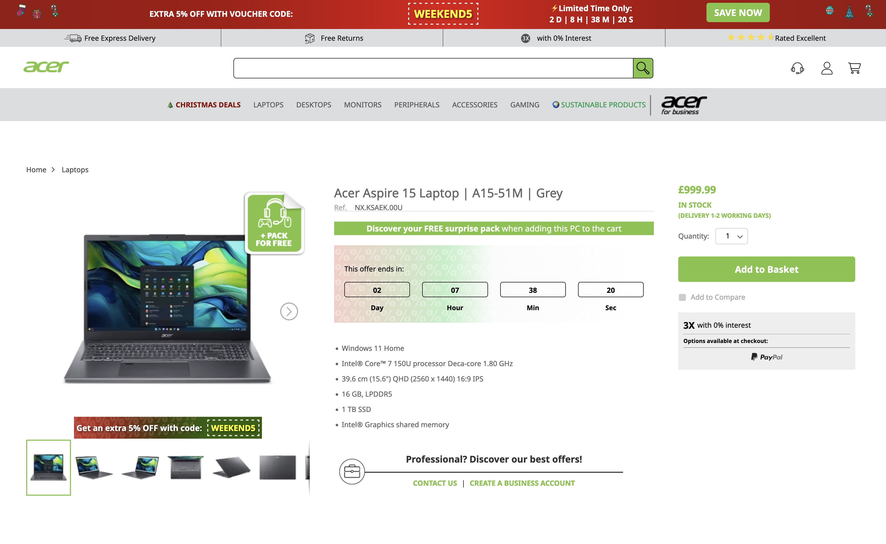
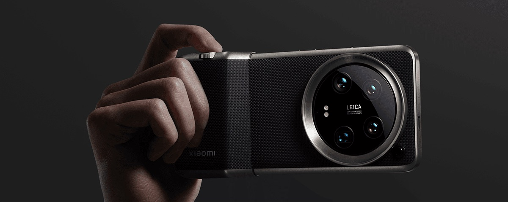
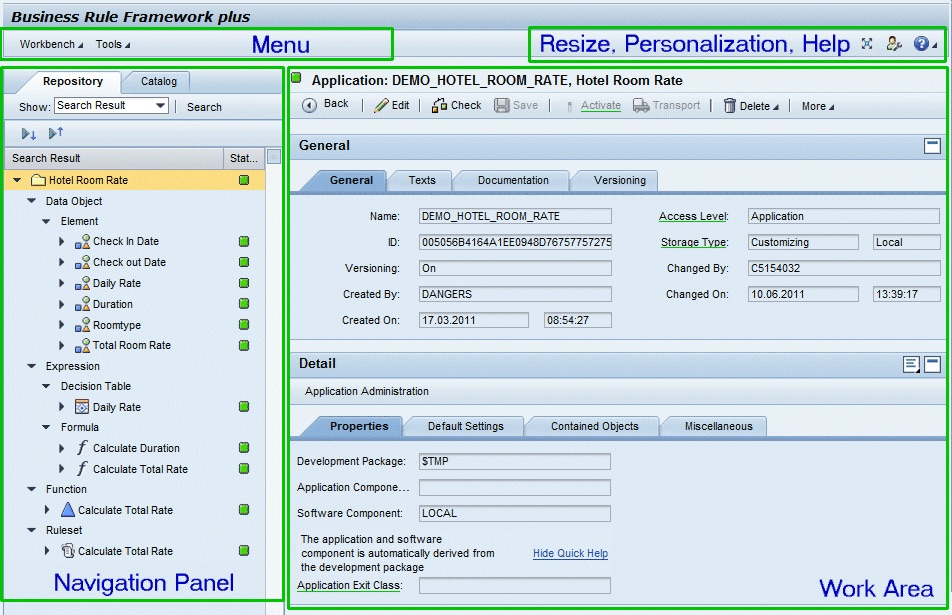

+++
title = 'User Experience is Everything'
date = 2024-01-14T07:07:07+01:00
author = 'Beppo Craig'
draft = false
+++

Think for a second about the concept of “User experience”. We’ve all heard it a million times, and we all have an idea of what it is: It’s the interaction that a user has with an app or a device. According to wikipedia, _User experience (UX) is how a user interacts with and experiences a product, system or service._ That sounds roughly correct, doesn’t it?

The problem I have with this definition is that, even if correct, it is exceedingly narrow. Imagine this hypothetical example: Apple offers an iPhone 17 UltraMax at the ludicrous price of $3000, which somehow you decide to buy; maybe you’re a huge fan of the brand, maybe you’ve had a windfall; whatever, just imagine this hypothetical scenario. _(Note: I’m keeping to consumer products for now, to make things easier to visualise)._

Wouldn’t the price of such an expensive phone change how you _“experience the product”_, in the words of Wikipedia? For example, you might not take it to the beach; to avoid the risk of getting the screen scratched by sand. You might find yourself uncomfortable using it in certain areas or in the presence of certain people, as it might draw unwanted attention by being overly flashy: people around you know it’s a $3000 phone, after all. Maybe, depending on your personality, you might even enjoy the attention. Maybe buying it gave you a tinge of regret, and maybe you’re even bitter about it because every time you take it out of the pocket you remember that you’re paying $250 a month on finance for a phone.

Now let’s imagine another hypothetical scenario: in this Parallel Universe #2, the iPhone 17 UltraMax replaces the “Pro” in the lineup, and thanks to some imaginary situation (maybe the price of semiconductors has gone down massively) this exact same iPhone 17 UltraMax is released at a price point of $800. You decide to buy it in this scenario as well.

The device in both scenarios is identical, but your day to day _experience_ with and around the phone is going to be somewhat different. You’re likely to be less concerned about it, it will be considered less flashy and draw less attention. Your interactions with the product are going to be different: you might treat it more like a workhorse rather than a precious jewel, use it more carelessly. It’s not a burden.

This is how _price_, which is a quality that we normally don’t associate with the term User Experience, can actually be a critical part of it. This happens because “User Experience” encompasses the complex psychological elements of the interaction between a user and a product.

## The Holistic Nature of User Experience
There is much more than _user interfaces_ to how a user experiences and interacts with a product! When considering User Experience, we need to include all the journey of the user from their first to their last interaction with the product. From this perspective, marketing is a part of the user experience. Even before buying the product or service, the user is already interacting with it in the shape of marketing materials, stores…

Consider the experience of buying a Framework Laptop, aimed mostly at enthusiasts and developers. It is not unlike Apple’s; a minimalist store presents you with choices for the components. The purchase process is aimed at making the experience unique; you’re buying a laptop tailored to your preferences.

In contrast, at the same price point, Acer offers a decidedly non-premium shopping experience, much closer to Tesco or Walmart than to the likes of Apple. _SAVE NOW_, *EXTRA 5% OFF*, *Discover your FREE surprise pack*. Acer doesn't try to say here: "you're special", it says "you're getting the best value for money".

This inevitably affects how the item gets perceived. Is it a commodity or is it something unique and custom made for me? These shopping experiences, coupled with the ads (or even third-party reviews!) that the buyer might have seen before, are the entrypoint to the User journey for these products.

Perception of _non-users_ affects this user experience too. For the past few months, my smartphone has been a Xiaomi 14 Ultra, which doesn’t just feature a large camera sensor, but a very large camera bump with a filter attachment. I love the versatility of having a phone that basically behaves like a real camera; but aesthetically, the design looks like an almost comical cross between a smartphone and a DSLR. As a result, I get questioned daily about _“what is that phone?” “what is the camera like?”_. Regardless of whether I enjoy getting asked those questions, they are undeniably part of my experience with this phone.

## The User's perspective
The reason why User Experience is so important is that a User can _exclusively_ assess a product based on the User Experience; either the _Actual_ User Experience (perceived after owning or using the product) or the _Expected_ User Experience (assumed through the marketing materials, reviews, and other information).

Let’s unpack this. Keeping to the smartphone example, people don’t choose a certain phone because of the processor, but rather, because of the _implication_ that a certain processor they know is going to result in a snappier, more fluid interface. If I told you that the iPhone 17 UltraMax comes with an Apple A20Z chip I’m giving you no useful information whatsoever; if I tell you that it’s 30% faster than last year’s iPhone 16 Pro, then this starts building your knowledge of the Expected User Experience.

Note there that the ultimate metric that the user assesses the phone by is how quick it feels or how long it takes to do certain tasks. Not the processor clock speed, not the benchmarks; those are all proxy metrics for how good it will subjectively feel. Unfortunately, that’s all they are. There have been cases where one manufacturer’s implementation of a processor results in a stuttery, overheating mess of a system where competitors’ smartphones are just fine. These might offer a similar Expected User Experience, but a radically different _Actual_ User Experience.

If what ultimately matters is how a product feels _subjectively_, then a rather annoying implication is that products can’t be evaluated objectively and rather need to be seen from the lens of user perspectives. This complicates the design of a product, as different users have different preferences, which means we need to get into market research to understand what ranks higher in the user preferences. If I can put $100 extra into the total production cost, what will be appreciated most, better materials or a better camera? The answer is usually not clear cut, and even regional preferences might play a part in this. Some countries will value highly the quality of the selfie camera, whereas in others this is not important and people would prefer a larger screen, if given the choice between these two.

Something pretty obvious then is that we need to understand well who is the user of our product/system/service… which is not necessarily that easy.

## The Non-Human User
“Wait a minute…” you might be thinking at this point, while preparing to grab the proverbial pitchfork. Bear with me for a moment: I promise I’m not going to involve AI using products! I’m talking about the world of B2B (business-to-business) services and products.

Picture this scenario: Company A (SAP) develops a product (SAP ERP) and sells that to Company B (Airbus), which Airbus employees use. Florian, an aerospace engineer working on the manufacturing processes for aircraft components in Tolouse, uses SAP ERP to keep track of the parts that go into each plane. We could continue; Florian and other employees ultimately manufacture an Airbus A350, that Airbus sells to British Airways and Jessica uses to fly from London to New York.

Now the interesting question is, Who's SAP ERP's User that SAP needs to take into account? 

The instinct of most of us is to say either Florian, or maybe even Jessica. However my position is that it isn't Florian that is the user, but rather *Airbus*. When SAP is developing their system, they need to think of the benefits, features and interactions from the point of view of the entity purchasing the software - Airbus in this case. What matters is that Airbus perceives SAP to:
- Make processes faster, hopefully by a measurable amount.
- Increased traceability (which may or may not be objectively measurable).
- Cost within limits that make the value proposition of the aircraft acceptable.

What Florian is in this perspective is an _Agent_ or _End User_ of the tool. They might perceive the app as slow, as cumbersome, as difficult to navigate, as frustrating even. But if the benefits above are true, unless the application is so bad that engineers and accountants leave in troves just to avoid SAP ERP, Airbus will be happy. Because the B2B world is strictly based around the capitalist system and the notion of market value, SAP doesn't need to consider the happiness of the End Users - just the Corporate Clients that buy the tool. 

In this example, Jessica is the *End Customer,* who is many layers removed from SAP and except for rare scenarios, won't be affected by the shortcomings of SAP ERP in any way she can perceive.

## Some Fun Implications
- The User and the *Assessor* are one in this model. Whoever is the decision maker for renewing the contract, buying the tool or product, is the person (or entity) that needs to be kept happy by having the needs fulfilled.
- When creating a tool, product or service, it is important to consider who we want to make happy: *Am I making this app for Airbus, or for Florian?* If it's the second, will they be able to even install the app, if the organisation doesn't have any incentives to approve its use?
- Some things, thankfully, escape the claws and laws of capitalism. I might make an app or implement a process that makes a certain step less frustrating for my fellow coworkers, but without taking any less time to do it. As the main stakeholders, my coworkers will be the users in here, if it's only their buy-in that I need for the implementation of the process/app. From the company's point of view I haven't achieved anything, if the step isn't more efficient.
- Emotions are what drives User Experience and ultimately acceptance of a product. This is why in the Intel era with terrible Macbooks full of compromises and thermal throttling, Apple was so highly regarded. Nice materials, great marketing, and the allure of a "premium" product.

And above all, that when designing a product or imagining a service, empathy wins: It's critical to think of the users of your product, and maximise their happiness, as this is the key metric to a successful product.